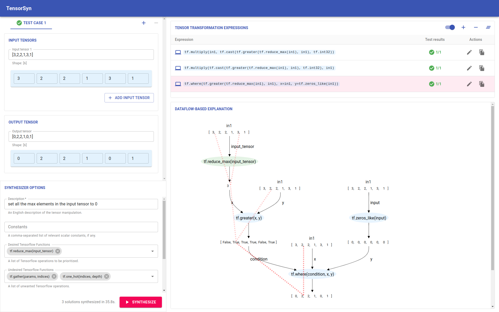

# INTENT: INteractive TENsor Transformation Synthesis
INTENT is a novel interactive program synthesizer for tensor transformation. It enables end users to *interactively* decompose a complex data transformation task to simpler ones to be solved by a synthesizer.

Overall, we make the following contributions:
- An interactive program synthesis system that takes multi-modal user specifications as input and generates tensor transformation code in TensorFlow on behalf of non-expert DL programmers.
- A novel dataflow visualization of tensor transformation code
with element-wise data provenance to help users understand
synthesized TensorFlow code.
- In-situ program editing and validation.

This implementation builds on [TF-Coder](https://github.com/google-research/tensorflow-coder), which is a program synthesis tool that runs a combinatorial search to find TensorFlow expressions. The `tensorflow-coder` package is modified to support extra features like data provenance lines.


## Interface


## Installation

### Package manager
**Miniconda (optional)**
Miniconda is a light-weight open source package management system for python.

Checkout https://docs.conda.io/en/latest/miniconda.html for installation instructions.
```
# create an env for int and keep it activated during development
$ conda create --name intent python=3.9
$ conda activate intent
```
**Yarn (required)**
Yarn is a package management system for js.

Checkout https://classic.yarnpkg.com/lang/en/docs/install/#debian-stable for installation instructions.

### Project dependency
**tensorflow-coder**
```
$ pip install -e ./tensorflow-coder
```
**server**
```
$ pip install -e ./server
```
**client**
```
$ cd client
$ yarn
```
## Launch INTENT
```
$ cd client
$ yarn build
$ cd ..
$ cd server
$ sh bin/INTENT_run.sh
```
Then go to 'http://localhost:8000' in your browser (chrome recommended).


## Credits
The project was developed under the supervision of [Prof. Tianyi Zhang](https://tianyi-zhang.github.io/) at Purdue and [Prof. Xingyu Wang](https://web.eecs.umich.edu/~xwangsd/) at UMich. Special thanks to [Yitao Huang](https://github.com/Yitao-Huang) and [Lyubing Qiang](https://github.com/EvelynQiang) for their contributions to the first version of INTENT.
